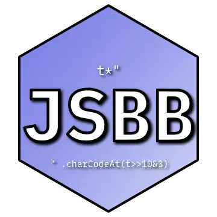

[

](https://butterroach.github.io/jstebeat/)

# [JStebeat](https://butterroach.github.io/jstebeat/)
## Online bytebeat player with some examples

Inspired by [SthephanShi's](https://www.dollchan.net/bytebeat) and
[psubscirbe's](https://psubscirbe-bytebeat.neocities.org/) players, but not forked from any player.

Planned to be made with vanilla HTML/CSS & TypeScript (no libraries other than CodeMirror and minor libraries, and
absolutely no frameworks).

### "Can you add my song to the library pls"

No. **Don't even open an issue about that**. The `library` issue tag is for mistakes, not requests.

### "How to fork/dev/contribute/etc.?"

1. Clone the repo (no instructions for this. if you don't know how to Google this, **please don't fork**)
2. `npm install`

Any changes relating to CSS (i.e. styling) are in `src/index.css` (CSS).

Any changes relating to color schemes and themes are in `src/colors.css` (CSS). Add new themes in the selection menu.
If you want to make a visualizer theme, you will need to create a TypeScript object holding your color scheme,
compatible with Catppuccin objects.

Any changes relating to the website structure itself are in `index.html` (HTML).

Any changes relating to the bytebeat processor (audio handling, running the bytebeat, etc., excluding visualizer
handling, including handling code state) are in `src/worklets/bytebeat-processor.ts` (TypeScript).

Any changes relating to any other code are in `src/index.ts` (TypeScript).

Any changes relating to configuration of the bundler are in `vite.config.ts` (TypeScript).

If you're forking into your own project, ***__CHANGE THE NAME AND LOGO, AND CHANGE THE COPYRIGHT STATEMENT IN
`LICENSE`__***.

### "GDI malware?"

No. Get out.

### "I'm trying to put it up online, but it's broken! It wasn't broken in local testing..."

Check out the dev console. If it says something about forks, well... :P

If it's something else then you definitely broke something. The first thing I'd check is if you're hosting on HTTPS or
not.

#### "...why does that matter"

Browsers are stupid and decided `AudioWorklet`s are high security and should only be on "secure contexts" (aka. HTTPS
and `localhost`). In fact that's exactly why you need self-signed certs when locally testing (don't worry, the repo
provides a self signed SSL cert for you. It expires in 44 years so I don't think you need to worry about that)

#### "How do I fix it"

Get SSL certs. You can get free ones from [Let's Encrypt](https://letsencrypt.org/). If you wanna be "edgy" then get one
of the paid providers.

#### "I'm too stupid for this"

Learn how to make websites.

### "I found a bug"

Open an issue on the GitHub repo and I'll review it!

### "I still want my song in the library"

Never.

### "Docker?"

hi artifish

#### "Who the hell is artifish"

:3

#### "You didn't answer me"

:3

### "...What even is a bytebeat"

In human terms:

Google it.

In monkey terms:

funny code do funny math. funny math do funny sound. funny sound go boom boom boom. boom boom boom do good sound. good
sound do woaaaaa
